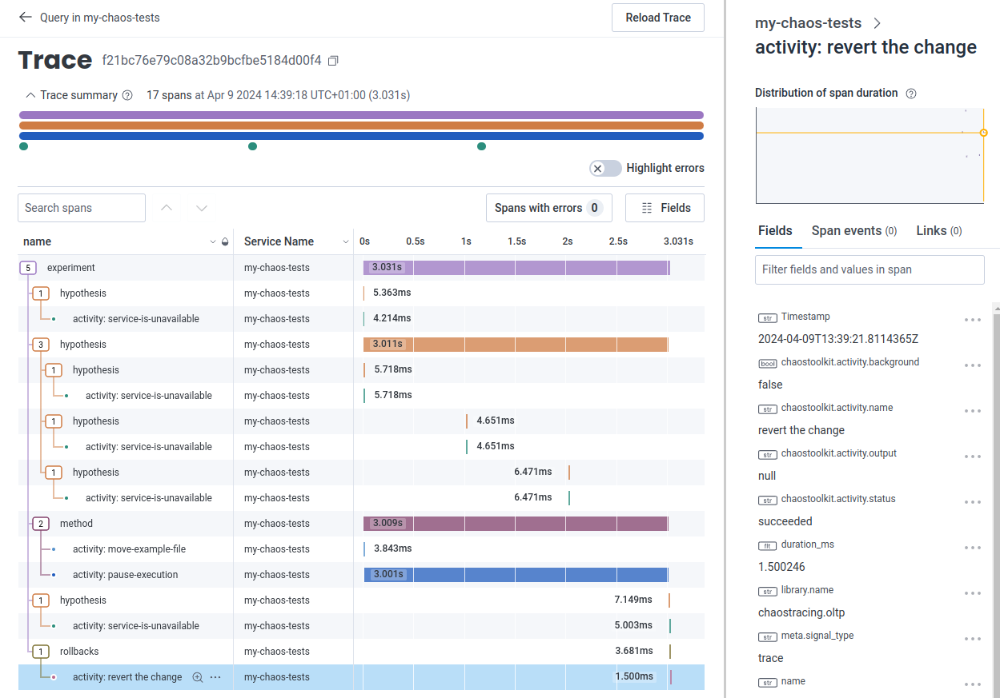

# fastapi chaostoolkit otel

## Overview

This project is a simple fast API app that we can use to run a chaos experiment against. The key focus of this repo is
to use the `chaostoolkit-opentracing` package to instrument the chaostoolkit and push its traces to a backend.

## setup

In order to set up the project you can install all the requirements through pip

```shell
pip install -r requirements.txt
```

You will need to set up environment variables for opentelemetry to export directly to your backend. We are not using 
a collector in this example. We are using honeycomb as the backend in this example

```shell
export OTEL_EXPORTER_OTLP_ENDPOINT=https://api.honeycomb.io
export OTEL_EXPORTER_OTLP_HEADERS=x-honeycomb-team\=hcaik_01hs5pepeqbjkXXXXXXXXXXXXXXXXXXXXXXX5wz16aka11crdd152p
export OTEL_SERVICE_NAME=my-chaos-tests
```

## Running the experiment

You will need to run these in two separate terminals

### Run the fastapi app

```shell
uvicorn main:app
```

### Run the chaos experiment

You will need to have set the OTEL environment variables in this terminal

```shell
chaos run experiment.yaml
```

## Example Trace

